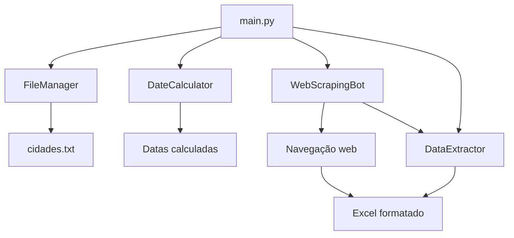

# 🏗️ Arquitetura

## Estrutura do Projeto

```
.
├── classes/
│   ├── web_scraping_bot.py    # Automação principal do Selenium
│   ├── data_extractor.py      # Extração e formatação de dados
│   ├── date_calculator.py     # Cálculo automático de datas
│   └── file_manager.py        # Gerenciamento de arquivos
├── docs/                      # Documentação
├── config.py                  # Configurações centralizadas
├── main.py                    # Script principal
├── cidades.txt               # Lista de cidades
└── requirements.txt          # Dependências Python
```

## Componentes Principais

### 🤖 WebScrapingBot
**Responsabilidades:**
- Configuração e controle do navegador Chrome
- Navegação e interação com elementos da página
- Automação do fluxo completo de preenchimento
- Coordenação entre diferentes etapas

**Métodos principais:**
- `configurar_navegador()` - Inicializa Chrome + ChromeDriver
- `processar_cidade()` - Fluxo completo para uma cidade
- `selecionar_cidade_mg()` - Seleção específica do estado MG

### 📊 DataExtractor
**Responsabilidades:**
- Extração de HTML da página de resultados
- Parsing com BeautifulSoup para encontrar tabelas
- Formatação e organização dos dados extraídos
- Geração de arquivos Excel com cores e layout

**Métodos principais:**
- `processar_pagina_resultados()` - Fluxo completo de extração
- `_salvar_excel_formatado()` - Excel com cores azul/vermelho
- `gerar_relatorio_consolidado()` - Relatório final

### 📅 DateCalculator
**Responsabilidades:**
- Cálculo automático de data inicial (1 mês antes)
- Formatação de datas no padrão DD/MM/AAAA
- Centralização da lógica de datas

### 📁 FileManager
**Responsabilidades:**
- Carregamento e validação do arquivo `cidades.txt`
- Tratamento de erros de arquivo e codificação
- Validação da lista de cidades

## Fluxo de Dados



## Padrões de Design

### 1. **Separation of Concerns**
- Cada classe tem uma responsabilidade específica
- Configurações centralizadas em `config.py`
- Lógica de negócio separada da interface

### 2. **Dependency Injection**
- DataExtractor é injetado no WebScrapingBot
- Permite flexibilidade na configuração

### 3. **Error Handling**
- Try/catch em todos os métodos críticos
- Logs detalhados para debug
- Recuperação automática quando possível

### 4. **Configuration-driven**
- Todos os seletores CSS em arquivo de configuração
- Timeouts e pausas configuráveis
- URLs e caminhos parametrizados 